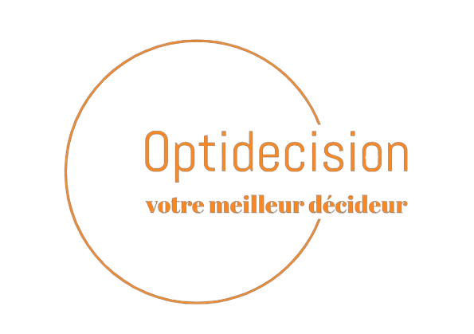

# OptiDecision Project



This document introduces OptiDecision, a platform designed to facilitate multicriteria decision-making (MCDM). By integrating advanced decision-making methods, we aim to provide users with a robust tool for evaluating and selecting optimal solutions based on various criteria. Our platform leverages the power of the AHP (Analytic Hierarchy Process) and TOPSIS (Technique for Order Preference by Similarity to Ideal Solution) methods to help users make informed decisions.


## Overview

OptiDecision is a multicriteria decision-making platform designed to handle complex decisions involving multiple, often conflicting criteria. By incorporating both the AHP and TOPSIS methods, OptiDecision allows users to systematically evaluate different options and select the most suitable one based on their specific requirements and preferences. The platform is built to be user-friendly, ensuring accessibility for a broad range of users, from individuals to organizations.

## Software Architecture


OptiDecision's architecture follows a decoupled approach, utilizing Django for backend infrastructure and React with Tailwind CSS for the frontend. This structure promotes scalability and maintainability while ensuring efficient communication between the frontend and backend.

### Backend

- **Framework:** Django
- **Database:** SQlite
- **Components:** The backend consists of various modules, including decision criteria management, decision method implementations, user management, and API endpoints for frontend communication.

### Frontend

- **Framework:** React
- **Styling:** Tailwind CSS
- **Components:** The frontend comprises components for data input, decision method execution, result visualization, and user interaction. 

## Docker Image

The project is containerized using Docker to ensure a consistent and reproducible environment.

### Docker Compose

```yaml
version: '3.8'

services:
  frontend:
    build:
      context: ./optidecision_frontend
    ports:
      - "3000:80"
    depends_on:
      - backend

  backend:
    build:
      context: ./optiDecisionBackend
    command: ["sh", "-c", "python manage.py migrate && python manage.py runserver 0.0.0.0:8000"]
    volumes:
      - ./optiDecisionBackend:/app
      - ./optiDecisionBackend/db.sqlite3:/app/db.sqlite3
    ports:
      - "8000:8000"

```

### Backend Dockerfile

```dockerfile
FROM python:3.9-slim
WORKDIR /app
COPY requirements.txt ./
RUN pip install --no-cache-dir -r requirements.txt
COPY . .
EXPOSE 8000
CMD ["sh", "-c", "python manage.py migrate && python manage.py runserver 0.0.0.0:8000"]
```

### Frontend Dockerfile

```dockerfile
# Build stage
FROM node:14 AS build
WORKDIR /app
COPY package.json package-lock.json ./
RUN npm install
COPY . ./
RUN npm run build

# Serve stage
FROM nginx:alpine
COPY --from=build /app/build /usr/share/nginx/html
COPY nginx.conf /etc/nginx/conf.d/default.conf
EXPOSE 80
CMD ["nginx", "-g", "daemon off;"]
```

## Frontend

### Technologies Used

- **React:** A JavaScript library for building user interfaces.
- **Tailwind CSS:** A utility-first CSS framework for rapid UI development.

### Project Structure

The React frontend is organized into several main components to ensure maintainability and scalability.

### Dependencies

```json
{
  "dependencies": {
    "react": "^17.0.2",
    "react-dom": "^17.0.2",
    "react-router-dom": "^5.2.0",
    "tailwindcss": "^2.2.19"
  },
  "devDependencies": {
    "postcss": "^8.3.6",
    "autoprefixer": "^10.2.6"
  }
}
```

## Backend

### Technologies Used

- **Django:** A high-level Python web framework.
- **SQLite:** file database.

### Project Structure

The Django backend is structured into various modules to handle different aspects of the application.

### Main Modules

1. **Decision Criteria Management:**
   - Handles CRUD operations for decision criteria.

2. **Decision Method Implementations:**
   - Implements AHP and TOPSIS methods.

3. **User Management:**
   - Manages user authentication and authorization.

4. **API Endpoints:**
   - Exposes RESTful APIs for frontend communication.

### Dependencies

```python
# requirements.txt
Django>=3.2,<4.0
djangorestframework>=3.12.4
psycopg2>=2.9.1
```

## Getting Started

### Prerequisites

1. **Git:** Ensure Git is installed.
2. **Docker:** Ensure Docker is installed and running.

### Backend Setup

1. **Clone the Project:**
   ```bash
   git clone <repository_url>
   cd optidecision
   ```

2. **Run Docker Compose:**
   ```bash
   docker-compose up --build
   ```

3. **Access Backend:**
   - The backend will be accessible at [http://localhost:8000](http://localhost:8000).

### Frontend Setup

1. **Access Frontend:**
   - The frontend will be accessible at [http://localhost:3000](http://localhost:3000).

## Usage

To use the OptiDecision platform, follow these steps:

1. **Add Decision Criteria:**
   - Use the Add Component to input decision criteria and alternatives.

2. **Run Decision Methods:**
   - Utilize the backend API to execute AHP and TOPSIS methods.

3. **View Results:**
   - Visualize the results on the Result Component.

## Folder Structure

### Backend

```
optidecision/
├── backend/
│   ├── app/
│   ├── manage.py
│   ├── requirements.txt
│   └── Dockerfile
└── docker-compose.yaml
```

### Frontend

```
optidecision/
├── frontend/
│   ├── public/
│   ├── src/
│   ├── package.json
│   ├── tailwind.config.js
│   ├── postcss.config.js
│   └── Dockerfile
└── docker-compose.yaml
```

## Dependencies

Refer to the respective `package.json` and `requirements.txt` files for detailed dependencies.


## Contributing

We welcome contributions from everyone. To contribute, please follow these guidelines:

- Fork the repository.
- Create a new branch for your feature or bugfix.
- Commit your changes with descriptive messages.
- Push your changes to the branch.
- Create a pull request to merge your changes.

### Contributors

- Noussair Abellouch ([GitHub](https://github.com/noussairox))
- Tarik ElQari ([GitHub](https://github.com/TarekElqari))
- Salma IdMansour ([GitHub]([https://github.com/rmakaoui](https://github.com/idsalma)))
- Meriem Lachgar ([Github](https://github.com/Mariembl))
- Anass idbella ([Github](https://github.com/Anassidbella/))
